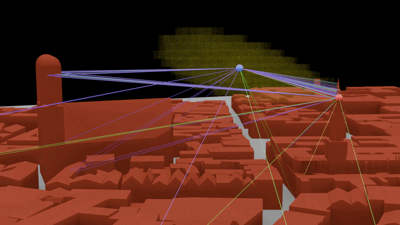

# Animated propagation paths and stacked-height radio map

This example demonstrates frame-dependent propagation-path computation and
stacked-height radio-map visualization in an urban Blender scene.

## Demonstrated features

- Frame-based Sionna RT execution
- Propagation-path visualization
- Stacked-height radio-map visualization
- Geometry Nodes filtering and rendering
- Animated scene or device configurations

The Blender scene, simulation configuration, and representative outputs will
be added before the v1.0.0 release.
