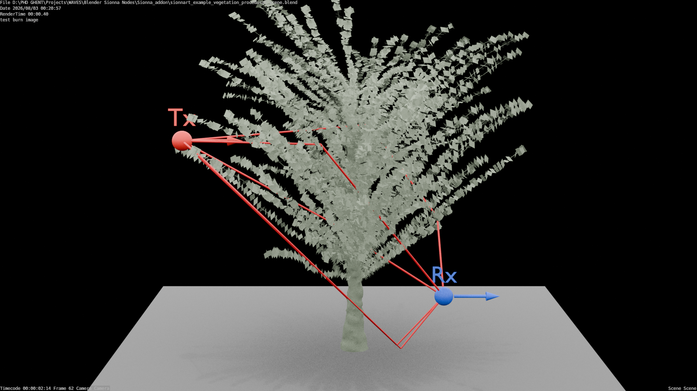

# Procedural vegetation growth and propagation paths

This self-contained Blender example demonstrates how frame-dependent
procedural vegetation affects Sionna RT propagation paths.

The plant geometry changes over the Blender timeline. SionnaRT-Bridge
evaluates the procedural geometry at each sampled frame, exports the evaluated
scene state, runs the propagation simulation, and imports the resulting paths
as attributed Blender geometry.

## Included files

- `sionnart_example_vegetation_procedural_scene.blend` - complete Blender
  scene containing the procedural plant, transmitter, receiver, simulation
  settings, imported path results, Geometry Nodes visualization, materials,
  camera, and animation.
- `procedural_plant_propagation_paths.png` - static preview image.
- `SHA256SUMS` - SHA-256 checksums for the Blender scene and preview image.

## Demonstrated features

- Procedural scene geometry
- Frame-dependent scene export
- Transmitter and receiver placement
- Propagation-path simulation
- Line-of-sight and non-line-of-sight path changes
- Path-interaction visualization
- Geometry Nodes filtering and styling
- Animation and parameter-sweep workflows

## Opening the example

1. Install Blender 5.2.
2. Install SionnaRT-Bridge v1.8.2.
3. Configure the external Sionna RT runtime as described in ../../docs/SIONNA_2_BLENDER_5_2_WINDOWS.md.
4. Open `sionnart_example_vegetation_procedural_scene.blend`.
5. Use the timeline to inspect the procedural plant growth.
6. Inspect the propagation-path result object and its Geometry Nodes
   modifier.
7. Inspect the Sionna RT sidebar for the recorded simulation settings.

## Re-running the simulation

Configure a compatible external Sionna RT environment as described in
../../docs/SIONNA_2_BLENDER_5_2_WINDOWS.md. The SoftwareX reference
environment uses Sionna 2.0.1, Sionna RT 2.0.1, Mitsuba 3.8.0,
DrJit 1.3.1, and h5py 3.16.0.

The example used in the SoftwareX manuscript is configured at 26 GHz.
Verify the frame range, solver settings, propagation mechanisms, antenna
configuration, and random seed in the Blender scene before executing it.

Run the propagation-path simulation over the configured frame range.
Procedural geometry is evaluated and exported independently for every sampled
frame.

## Interpretation

The example illustrates how increasing vegetation geometry can obstruct the
direct transmitter-receiver connection and alter the number, geometry, and
strength of the returned propagation paths.

Path-gain values should be read from the imported numerical attributes rather
than estimated from the rendered path color or radius.

## Software environment

- Blender 5.2
- Blender Python 3.13
- SionnaRT-Bridge v1.8.2
- Sionna 2.0.1
- Sionna RT 2.0.1
- Mitsuba 3.8.0
- DrJit 1.3.1
- h5py 3.16.0
